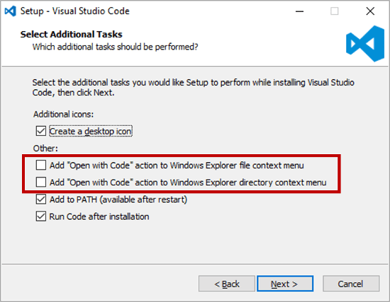
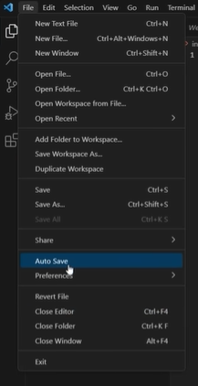
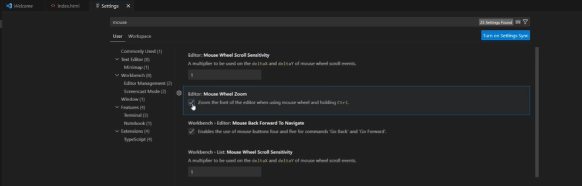
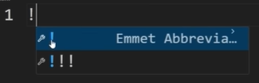

# [Video 1 - Installing VS Code & How websites work](https://www.youtube.com/watch?v=tVzUXW6siu0&list=PLu0W_9lII9agq5TrH9XLIKQvv0iaF2X3w&index=1)

## VS Code

### What is VS Code?
Visual Studio Code (VS Code) is a free, open-source code editor developed by Microsoft. It is a lightweight yet powerful tool commonly used by developers for writing, editing, and debugging code in various programming languages. VS Code offers a wide range of extensions and customization options, making it a popular choice among programmers for a diverse set of development tasks. It supports multiple operating systems, making it a versatile code editor for various development needs.

### Download and Install
Click [here](https://code.visualstudio.com/download) to visit official site of microsoft to download VS Code for your OS.<br>
Installing VS Code is as easier as a game you just need to click "next"->"next" to install it in your device.<br>
**IMPORTANT** - Click on the "Open with code" checkbox before installing it, these will help you to open folders in VS Code.


## Begin With the Course
- Create a folder "Sigma Web Dev Course" and store all files used in the course there. This will help to Keep things organized.
- Create an index.html and follow the [tutorial](https://www.youtube.com/watch?v=tVzUXW6siu0&list=PLu0W_9lII9agq5TrH9XLIKQvv0iaF2X3w&index=1)
- Make sure you enable "Auto Save" feature from VS code which will automatically save files if you change them!

- You can also configure mouse wheel zoom from settings

- Typing ```!``` and then pressing enter in the index.html file gives you a boilerplate code for the html file.

- You can use ```ctrl + +``` to zoom in your VS code window.

## How does website works?
A website works using 3 types of things.
- Client (Me, you, everyone who uses browser)
- Server (The data is stored in the servers)
- Browser (The thing which displayes the content in a graphical form to the client received from the server)

Example: When you type in ```google.com``` in the address bar, you are a client requesting browser to get the content of google and display it to you(client) in the browser window, and the browser gets the data from the server and displayes to client(you).

- Backend's code is not visible to the user and it is confidential, you will learn more about backend in future tutorials

- **Frontend** is mainly made of 3 languages: **HTML, CSS and JavaScript**

### You can get the source code of this video [here](https://github.com/CodeWithHarry/Sigma-Web-Dev-Course/tree/main/Video%2001)

## [Checkout Video 2 Source code and notes](https://github.com/CodeWithHarry/Sigma-Web-Dev-Course/tree/main/Video%202)